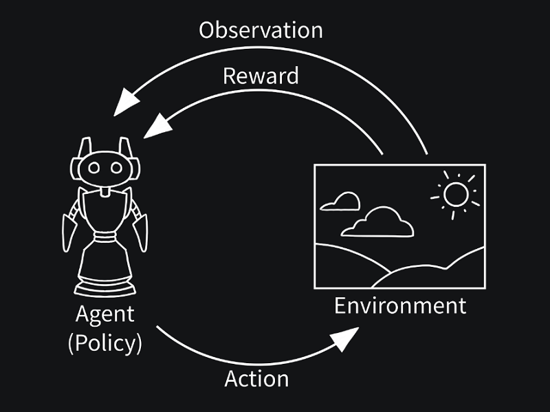
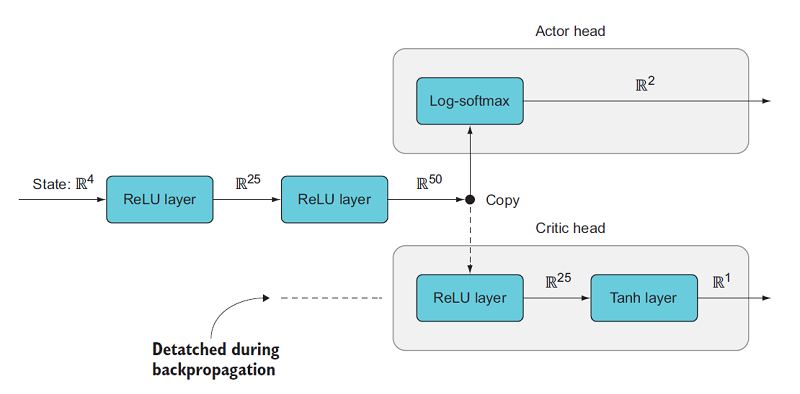
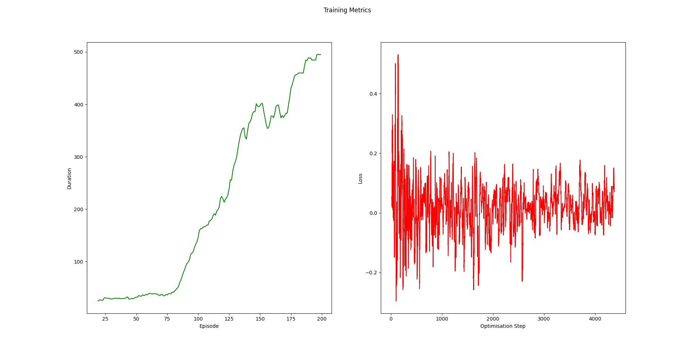
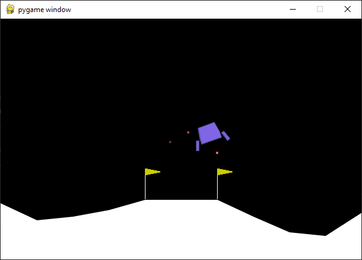

## Advantage Actor-Critic (A2C) Reinforcement Learning (RL) Agent

This A2C RL agent is based on the Asynchronous A2C (A3C) agent in [Deep Reinforcement Learning in Action](https://www.manning.com/books/deep-reinforcement-learning-in-action), but with tuned hyperparameters, and without asynchronous processing.

A2C agents combine a Deep Q-network (DQN) like that used by [DeepMind](https://www.deepmind.com/publications/playing-atari-with-deep-reinforcement-learning) with a policy network like REINFORCE. They provide direct sampling of actions from a distribution (like a policy network) whilst also supporting rapid online learning (like a DQN, but without the need for experience replay or a target network). 

The A2C agent learns to play the [Cart Pole](https://gymnasium.farama.org/environments/classic_control/cart_pole/) game environment in [Gymnasium](https://gymnasium.farama.org/content/basic_usage/):



_OpenAI Gym, OpenAI, 2022_

The agent is a two-headed feed-forward neural network:



_Deep Reinforcement Learning in Action, Manning, 2020_

Here the agent is being trained to play Cart Pole.



And here the trained agent is playing the game unaided:



### What about playing other games?

The A2C agent can be used to play any game as long as the size of the observation space and action space are set in ```actor-critic-agent.py``` and ```main.py``` is updated to correctly handle rewards. There is a [branch of this repository](https://github.com/alpine-chamois/actor-critic/tree/lunar-lander) that shows how it can be successfully trained to play the [Lunar Lander](https://gymnasium.farama.org/environments/box2d/lunar_lander/) game in Gymnasium.

### Why A2C and not A3C or PPO?

Although A3C and PPO agents can perform better than A2C agents, they include additional complexity that makes the fundamentals of RL more difficult to understand when looking at the code. This A2C agent is designed to be a reference for how to implement a Deep RL (DRL) agent using [PyTorch](https://pytorch.org/). If you want a PPO agent, I recommend using [the implementation in Stable Baselines 3](https://stable-baselines3.readthedocs.io/en/master/modules/ppo.html). There is a [branch of this repository](https://github.com/alpine-chamois/actor-critic/tree/stable-baselines) that shows how to implement an equivalent A2C agent using Stable Baselines 3, and to convert this agent to a PPO agent, simply replace ```A2C``` with ```PPO``` everywhere in ```main.py```. You can also experiment with the asynchronous abilities of PPO agents by using a [vectorised environment](https://gymnasium.farama.org/api/vector/).

### Useful [Machine Learning Mastery](https://machinelearningmastery.com/) links for setting hyperparameters
* [Choosing the number of hidden layers and neurons in a neural network](https://machinelearningmastery.com/how-to-configure-the-number-of-layers-and-nodes-in-a-neural-network/)
* [Choosing activation functions for a neural network](https://machinelearningmastery.com/choose-an-activation-function-for-deep-learning/)
* [Choosing the learning rate for a neural network](https://machinelearningmastery.com/learning-rate-for-deep-learning-neural-networks/)

### [Colin Skow](https://github.com/colinskow)'s excellent reinforcement learning tutorials

* [Bellman Equation Basics for Reinforcement Learning](https://www.youtube.com/watch?v=14BfO5lMiuk)
* [Bellman Equation Advanced for Reinforcement Learning](https://www.youtube.com/watch?v=aNuOLwojyfg)
* [Dynamic Programming Tutorial for Reinforcement Learning](https://www.youtube.com/watch?v=aAkFtRxeP7c)
* [Monte Carlo Reinforcement Learning Tutorial](https://www.youtube.com/watch?v=mMEFFN1H5Cg)
* [Policy Gradient Methods Tutorial](https://www.youtube.com/watch?v=0c3r5EWeBvo)
* [Actor Critic (A3C) Tutorial](https://www.youtube.com/watch?v=O5BlozCJBSE)
* [Continuous Action Space Actor Critic Tutorial](https://www.youtube.com/watch?v=kWHSH2HgbNQ)
* [Proximal Policy Optimization (PPO) Tutorial](https://www.youtube.com/watch?v=WxQfQW48A4A)

### [Rudy Gilman](https://rudygilman.com/)'s story explaining A2C in terms of animal learning
* [Intuitive RL: Intro to Advantage-Actor-Critic (A2C)](https://medium.com/hackernoon/intuitive-rl-intro-to-advantage-actor-critic-a2c-4ff545978752)

### Getting started (Windows)

__Prerequisites:__ Python 3.10 

1. Create a virtual environment:
    ```
    >python -m venv venv
    >venv\Scripts\activate
    ```
1. Install wheel:
    ```
    (venv) >pip install wheel
    ```
1. Install dependencies:
    ```
    pip install -r requirements.txt
    ```
1. Install the local package in editable mode:
    ```
    (venv) >pip install -e .\src
    ```
1. Run the example:
    ```
    (venv) >python -m actorcritic --train
    ```
