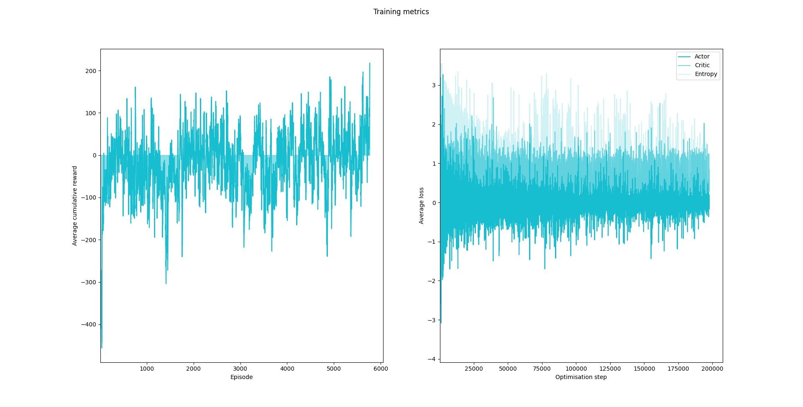

## Advantage Actor-Critic (A2C) Deep Reinforcement Learning (DRL) Agent

This A2C DRL agent is based on the Asynchronous A2C (A3C) agent in [Deep Reinforcement Learning in Action](https://www.manning.com/books/deep-reinforcement-learning-in-action), but with tuned hyperparameters, and without asynchronous processing.

A2C agents combine a policy network (actor) and a value network (critic). They provide direct sampling of actions from a distribution and use the critic to estimate a baseline for advantage computation, enabling efficient and stable online learning.

The A2C agent learns to play the [Cart Pole](https://gymnasium.farama.org/environments/classic_control/cart_pole/) game environment in [Gymnasium](https://gymnasium.farama.org/content/basic_usage/):


_OpenAI Gym, OpenAI, 2022_

The agent is a two-headed feed-forward neural network:


_Deep Reinforcement Learning in Action, Manning, 2020_

Here the agent is being trained to play Cart Pole.



And here the trained agent is playing the game unaided:


### Why A2C and not A3C or PPO?

Although A3C and PPO agents can perform better than A2C agents, they include additional complexity that makes the fundamentals of DRL more difficult to understand when looking at the code. This A2C agent is designed to be a reference for how to implement a DRL agent using [PyTorch](https://pytorch.org/). If you want a PPO agent, I recommend using [the implementation in Stable Baselines 3](https://stable-baselines3.readthedocs.io/en/master/modules/ppo.html). There is a [branch of this repository](https://github.com/alpine-chamois/actor-critic/tree/stable-baselines) that shows how to implement an equivalent A2C agent using Stable Baselines 3, and to convert this agent to a PPO agent, simply replace instances of ```A2C``` with instances of ```PPO```.

### Getting started

## Setup
[Install UV](https://docs.astral.sh/uv/getting-started/installation/), then run the following command:

```
uv sync
```

## Run the Example
```
uv run -m  actorcritic --train --render
```
